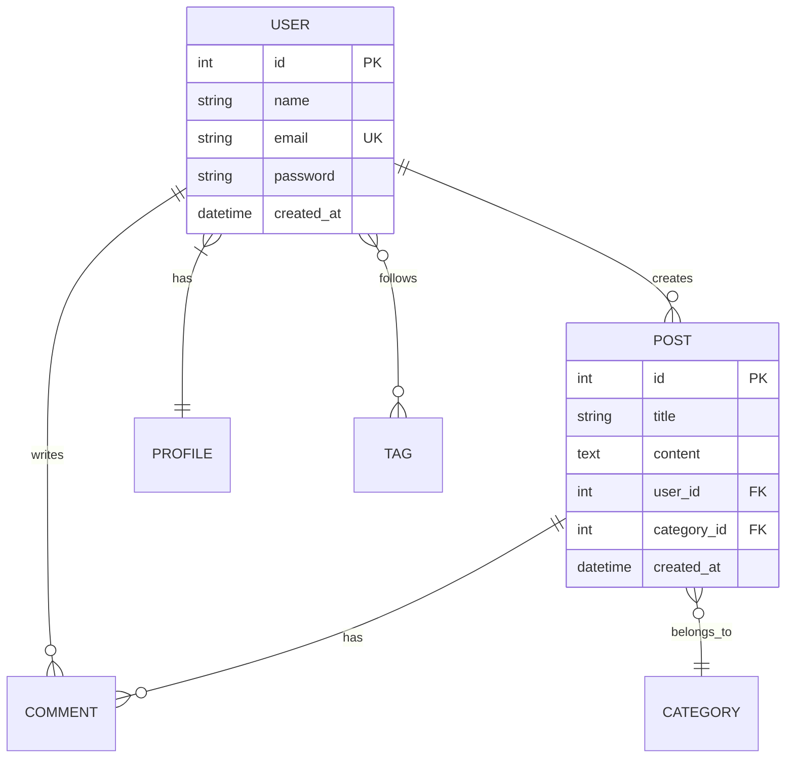

# LocoMotive

[](https://github.com/UtakataKyosui/locomotive/actions/workflows/ci.yml)
[](https://github.com/UtakataKyosui/locomotive/actions/workflows/release.yml)
[](https://crates.io/crates/locomotive)
[](https://opensource.org/licenses/MIT)

OpenAPI 3.0 specification と ER図から [Loco](https://loco.rs/) フレームワーク用のスキャフォールドコマンドを自動生成するRustプログラムです。

## 機能

- 📊 **OpenAPI 3.0 解析**: 複雑なAPIスキーマを完全サポート
- 🚀 **Locoスキャフォールド生成**: `cargo loco generate scaffold` コマンドを自動生成
- 🔗 **参照関係検出**: `user_id` → `user:references` 自動変換
- 🗂️ **ER図統合**: MermaidのER図と連携してデータベース関係性を正確に表現
- 📝 **複数出力形式**: コマンド、スクリプト、レポート、JSON形式に対応
- 🎯 **型マッピング**: OpenAPI型からLoco型への適切な変換
- 📋 **複数ファイル形式**: `.md`, `.mermaid`, `.mmd` ファイル対応

## インストール

### 方法1: Cargo Install (推奨)

```bash
cargo install locomotive
```

### 方法2: Pre-built Binaries

[Releases page](https://github.com/UtakataKyosui/locomotive/releases) からプラットフォーム別のバイナリをダウンロード

### 方法3: ソースからビルド

#### 前提条件
- Rust 1.70以上
- Cargo

#### ビルド手順
```bash
git clone https://github.com/UtakataKyosui/locomotive.git
cd locomotive
cargo build --release
```

## 使用方法

### 基本的な使用方法

```bash
# OpenAPIファイルからスキャフォールドコマンドを生成
lcm generate --input openapi.json

# ER図と組み合わせてより正確な関係性を表現
lcm generate --input openapi.json --er-diagram schema.md

# 詳細な分析を実行
lcm analyze --input openapi.json --verbose

# ER図を含む詳細分析
lcm analyze --input openapi.json --er-diagram schema.md --verbose
```

### 出力形式の指定

```bash
# コマンド形式（デフォルト）
lcm generate --input openapi.json --format commands

# 実行可能なbashスクリプト
lcm generate --input openapi.json --format script

# 詳細なマークダウンレポート
lcm generate --input openapi.json --format report

# JSON形式の構造化データ
lcm generate --input openapi.json --format json
```

### APIオンリーモード

Locoの`--api`フラグを使用してAPI専用スキャフォールドを生成：

```bash
lcm generate --input openapi.json --api

# ER図と組み合わせたAPIオンリーモード
lcm generate --input openapi.json --er-diagram schema.md --api
```

## 例

### 入力: OpenAPI仕様

```json
{
  "openapi": "3.0.0",
  "info": {
    "title": "User API",
    "version": "1.0.0"
  },
  "paths": {
    "/users": {
      "post": {
        "requestBody": {
          "content": {
            "application/json": {
              "schema": {
                "$ref": "#/components/schemas/User"
              }
            }
          }
        }
      }
    }
  },
  "components": {
    "schemas": {
      "User": {
        "type": "object",
        "required": ["email", "username"],
        "properties": {
          "id": {
            "type": "integer",
            "format": "int64"
          },
          "email": {
            "type": "string",
            "format": "email"
          },
          "username": {
            "type": "string",
            "minLength": 3,
            "maxLength": 50
          },
          "created_at": {
            "type": "string",
            "format": "date-time"
          },
          "profile_id": {
            "type": "integer",
            "format": "int64"
          }
        }
      }
    }
  }
}
```

### 出力: Locoスキャフォールドコマンド

```bash
cargo loco generate scaffold user id:int email:string! username:string! created_at:datetime profile_id:references:profile
```

## ER図統合機能

### サポートされるファイル形式

- **Markdownファイル** (`.md`): MermaidのER図を含むドキュメント
- **Mermaidファイル** (`.mermaid`, `.mmd`): 純粋なMermaid記法のファイル

### ER図の例



### ER図を使った利点

1. **正確な関係性表現**: OpenAPIだけでは表現できない複雑な関係性を記述
2. **データベース設計の可視化**: 全体のデータ構造を視覚的に確認
3. **関係タイプの詳細指定**: 1:1, 1:N, N:1, N:N の関係性を正確に表現
4. **外部キー制約の明示**: 参照整合性を保った設計
5. **包括的なレポート**: 関係性情報を含む詳細なドキュメントを生成

## 型マッピング

| OpenAPI型 | Loco型 | 説明 |
|-----------|---------|------|
| `integer` | `int` | 整数型 |
| `number` | `float` | 浮動小数点数 |
| `string` | `string` | 文字列 |
| `string` (maxLength > 255) | `text` | 長いテキスト |
| `boolean` | `boolean` | ブール値 |
| `string` (format: date-time) | `datetime` | 日時 |
| `string` (format: date) | `string` | 日付 |
| `array` | `string` | 配列（JSON形式） |
| `object` | `string` | オブジェクト（JSON形式） |

## 参照関係の検出

プログラムは以下のパターンで参照関係を自動検出します：

- `user_id` → `user:references`
- `product_id` → `product:references`  
- `category_id` → `category:references`
- `*_id` → `*:references`

## 複雑なAPIスキーマ対応

- ✅ ネストしたオブジェクト
- ✅ 配列フィールド
- ✅ enum型
- ✅ バリデーション制約（required、pattern、length）
- ✅ 複数の参照関係
- ✅ 循環参照対応

## サブコマンド

### `generate`

OpenAPIスキーマからLocoスキャフォールドコマンドを生成

**オプション:**
- `--input, -i <FILE>`: 入力OpenAPIファイル（必須）
- `--output, -o <FILE>`: 出力ファイル（省略時は標準出力）
- `--er-diagram <FILE>`: ER図ファイル（.md, .mermaid, .mmd）
- `--format, -f <FORMAT>`: 出力形式 [commands|script|report|json]
- `--api`: API専用スキャフォールド（--apiフラグ追加）

### `analyze`

OpenAPIスキーマの詳細分析を実行

**オプション:**
- `--input, -i <FILE>`: 入力OpenAPIファイル（必須）
- `--er-diagram <FILE>`: ER図ファイル（.md, .mermaid, .mmd）
- `--verbose`: 詳細なフィールド情報を表示

## 開発

### テストの実行

```bash
cargo test
```

### 統合テストの実行

```bash
cargo test --test integration_test
```

### Lintとフォーマット

```bash
cargo clippy
cargo fmt
```

## 依存関係

- `openapiv3`: OpenAPI 3.0仕様の解析
- `clap`: コマンドライン引数解析
- `serde`: JSON/YAML シリアライゼーション
- `handlebars`: テンプレート生成
- `convert_case`: 文字列ケース変換
- `pulldown-cmark`: Markdownファイルの解析
- `nom`: Mermaid記法のパースライブラリ
- `regex`: 正規表現によるパターンマッチング

## ライセンス

このプロジェクトは MIT ライセンス の下で公開されています。

## 貢献

プルリクエストやイシューの報告を歓迎します！

## 作者

- 開発者: あなたの名前
- Email: your.email@example.com
- GitHub: https://github.com/your-username

---

## 実行例

### E-commerceサンプル

高度なE-commerce APIスキーマでの実行例：

```bash
# 分析実行
lcm analyze --input examples/ecommerce-api.json

# スキャフォールド生成
lcm generate --input examples/ecommerce-api.json --format report

# 生成されたコマンドの例
cargo loco generate scaffold user id:int! email:string! username:string! first_name:string last_name:string --api
cargo loco generate scaffold product id:int! name:string! price:float! category_id:references:category! --api
cargo loco generate scaffold order id:int! user_id:references:user! total_amount:float! status:string! --api
```

### 出力サンプル

```
🔍 OpenAPI Analysis Results

File: ecommerce-api.json
Resources found: 17

📊 Generation Summary:
  - Resources processed: 17
  - Total fields: 105
  - Reference relationships: 12
  - Required fields: 45
```

## バージョン履歴

### v0.5.0 (2025-09-06)

- 🗂️ **ER図統合機能追加**: MermaidのER図と連携してデータベース関係性を正確に表現
- 📋 **複数ファイル形式サポート**: `.md`, `.mermaid`, `.mmd` ファイル対応
- 🔗 **関係性の詳細表現**: 1:1, 1:N, N:1, N:N の関係タイプを正確に識別
- 📊 **レポート機能強化**: ER図の関係性情報を含む包括的なレポート生成
- 🧪 **テストカバレッジ向上**: ER図機能の完全なテストスイート追加

### v0.3.0 (2025-09-06)

- ✨ **ユニーク制約サポート**: `^`記号でユニーク制約を表現
- 🔧 **非NULL制約**: `!`記号で必須フィールドを明示
- 🎯 **型マッピング改善**: より正確なOpenAPI型からLoco型への変換

### v0.1.0 (2025-09-06)

- 初回リリース
- OpenAPI 3.0完全サポート
- 複数出力形式対応
- 参照関係自動検出機能
- 複雑なスキーマ対応

---

**Happy Coding!** 🚀