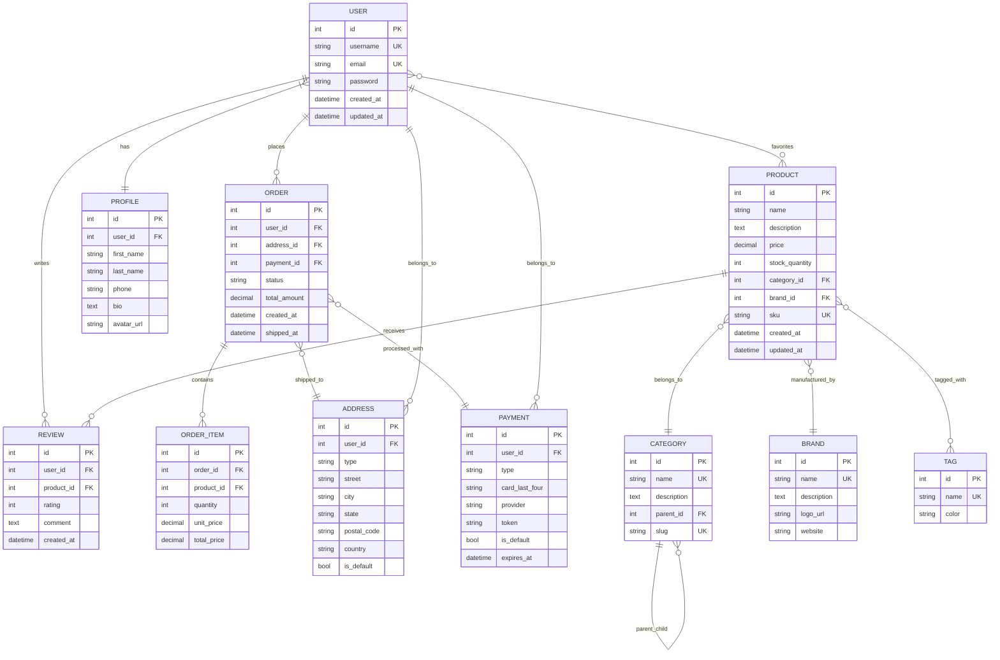

# Complex E-commerce Database Design

This is a complex ER diagram for an e-commerce system.

## Relationship Summary

- Users can place multiple orders and write reviews
- Users have one profile and can favorite multiple products
- Orders contain multiple items and are associated with shipping addresses and payments
- Products belong to categories and brands, can have multiple reviews and tags
- Categories can have parent-child relationships (hierarchical)
- Addresses and payments belong to users
- Many-to-many relationships: User-Product (favorites), Product-Tag