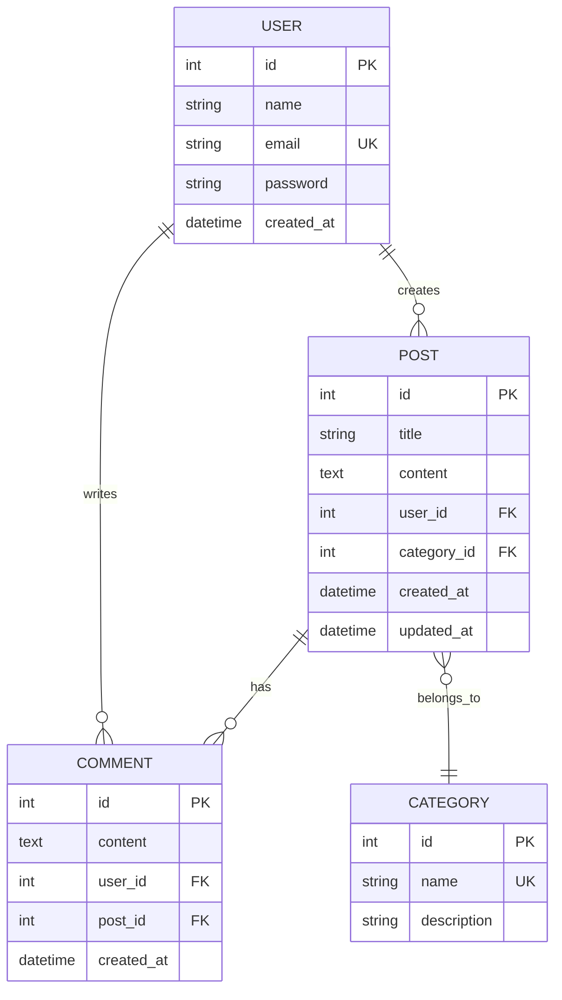

# データベース設計

このプロジェクトのER図です。

```mermaid
erDiagram
    USER ||--o{ POST : creates
    USER ||--o{ COMMENT : writes  
    POST ||--o{ COMMENT : has
    POST }o--|| CATEGORY : belongs_to
    USER {
        int id PK
        string name
        string email UK
        string password
        datetime created_at
    }
    POST {
        int id PK
        string title
        text content
        int user_id FK
        int category_id FK
        datetime created_at
        datetime updated_at
    }
    COMMENT {
        int id PK
        text content
        int user_id FK
        int post_id FK
        datetime created_at
    }
    CATEGORY {
        int id PK
        string name UK
        string description
    }
```

## 説明

- ユーザーは複数の投稿を作成できます
- ユーザーは複数のコメントを書けます
- 投稿は複数のコメントを持てます
- 投稿は1つのカテゴリに属します